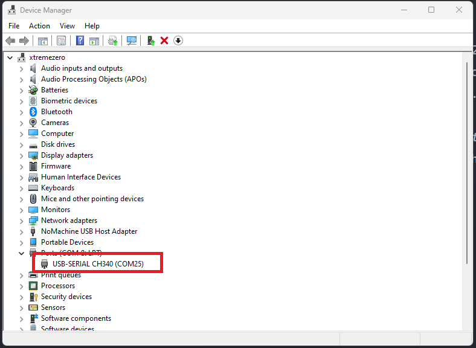
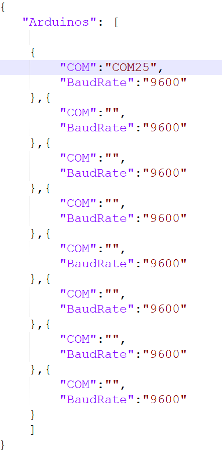

# FastFeet User Manual

### Contents

-	Installation and Setup:
	-	Software Setup
	-	Hardware Installation

-	Troubleshooting:
	-	Sensor Error
	-	Fetch Data Error
	-	Upload Data Error
	-	Lost Connection With Server
	-	Player scores are unusual
-	Adjustable Settings:
	-	Game Duration
	-	Score Multiplier
	
***  
### Installation and Setup

**Software Setup**
The game is installed with 2 configuration files  `settings.txt` and `Arduino.json`, you can find them instaled at `Documents/Github/FastFeet`.   

-	To configure the game *timer* or *score multiplier*, open `settings.txt` and edit the values like the following :  

	```
	{
	"Timer":30,
	"ScorePerGoal":5
	}
	```

	this will make the game run for 30seconds , and each goal scores 5 points.

-	To configure the hardware sensors data, open `Arduino.json` with a text editor, and move to the `Hardware Installation` step below:

**Hardware Installation**  
0- Unplug all the connected arduino sensors.  
1- Connect the USB HUB to PC and PowerPlug.  
2- Connect **ONLY ONE** arduino device into the USB hub.  
3- Open Device Manager and take note of the Port number (i.e COM25) as shown below :



4- Go back to `Arduino.json` file and change the first record to be the following :



5- Repeat the previous 2 steps by adding an arduino sensor *ONE AT A TIME* and writing the coresponding `Port number` *In The Order From Left To Right*.

6- Save the file and restart the game, and test it by playing one game, the Lights should turn off in sequence from Left to Right.


<br>

***   

###  Troubleshooting

**Sensor Error**

> One or more sensor are disconnected or wrongly installed.
	
*Solution:*	

>  1- Make sure all the hardware connections are added properly.  
>  
>  2- If everything is connected redo the setup procedure.
>  
>  3- If the issue persists, please contact support. 

<br>
<br>

**Lost Connection With Server**

> The game has lost connection to internet.

*Solution:*
> 
> 1- Check that the device is connected to the internet, if not, contact the  technicians responsible for the internet connection and have them fix it.
> 
> 2- The game will restart automatically as soon as internet is connected.
> 
> 3- If the issue persists ,contact support.


<br>
<br>

**Fetch Data Error**
> The game is not able to download the leaderboard list.

*Solution:*
> 1- Check that the device is connected to the internet, if not, contact the  technicians responsible for the internet connection and have them fix it.
> 
> 2- Sait for couple of seconds then press restart.
> 
> 3- If the issue persists ,contact support.


<br>
<br>

**Upload Data Error**
> The game is not able to upload the player score.

 
*Solution:*
> 1- Check that the device is connected to the internet, if not, contact the  technicians responsible for the internet connection and have them fix it.
> 
> 2- Sait for couple of seconds then press restart.
> 
> 3- If the issue persists ,contact support.
> 
> Inform the player to try again later, because their score wasn't uploaded to the leader board.


<br>
<br>

**Player scores are unusual**
> One or more player has very huge score i.e : 100 to 900, which can be an issue with the sensors ,or game configuration settings.
 
*Solution:*
> 1- Check that all the sensors are not broken or deattached.
> 
> 2- open `settings.txt` file and make sure that `scorePerGoal` is equal to 1.
> 
> 3- Contact support if issue persists. 

<br>

###  Adjustable Settings
The following settings can be customized and tweaked through the `settings.txt` file located at `Documents/Github/FastFeet`

**Game Duration**
1. Locate the project files, should be under 
Documents/Github/FastFeet
2. Open settings.txt file
3. Changing the “Timer” value will change how long the user can play the game 
for
4. Save settings.txt
6. Launch the game

**Score Multiplier**
1. Locate the project files, should be under 
Documents/Github/FastFeet
2. Open settings.txt file
3. Changing the “ScorePerGoal” value will change how much points are added when a player scores a goal
5. Save settings.txt
6. Launch the game

